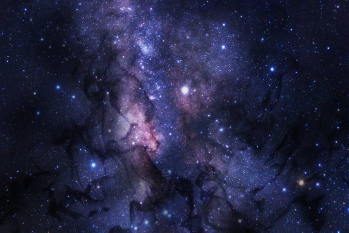
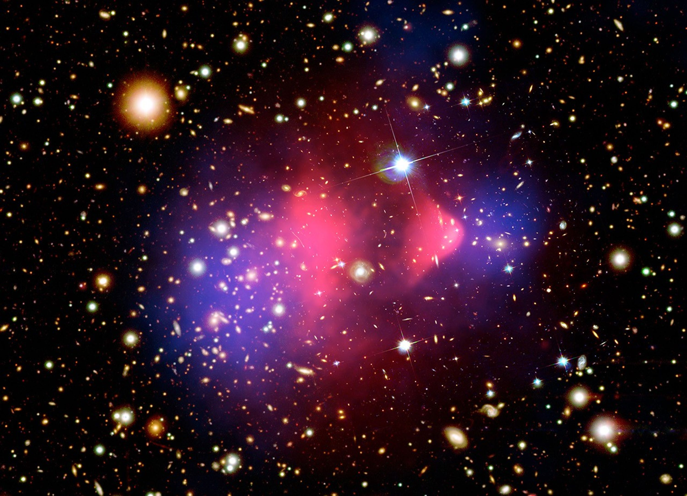
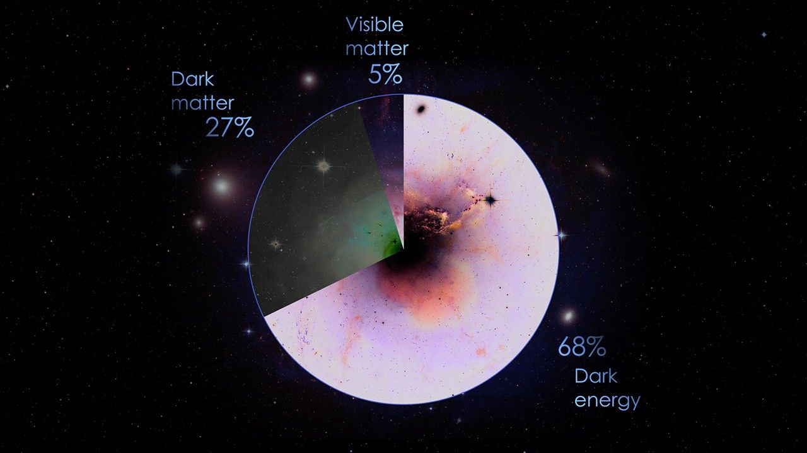

# Dark Matter

## What is Dark Matter?
Dark matter is the invisible glue that holds the universe together. This mysterious material is all around us, making up most of the matter in the universe. But what exactly is dark matter? That's a question that scientists have been trying to solve for almost 100 years. 

Dark matter makes up most of the mass in galaxies and galaxy clusters. In fact, scientists estimate that ordinary matter makes up only about 5% of the universe, while dark matter makes up about 27%. (The rest is thought to be dark energy, which is its own mystery). It's thought that dark matter shapes the cosmos, organizing galaxies and cosmic objects on a large scale. 

From stars and galaxies to the shoes on your feet, ordinary matter makes up everything we can see in the universe — in wavelengths spanning from the infrared to visible light and gamma rays. While dark matter interacts with ordinary matter through gravity, it does not seem to interact at all with the electromagnetic spectrum, including visible light. So dark matter doesn't absorb, reflect, or emit any light. 

While dark matter is invisible, it does have some things in common with ordinary matter: It takes up space and it holds mass. Because of this, we can see how it interacts with and influences ordinary matter throughout the universe, which is how we're able to "see" and study dark matter. 

## Discovering Dark Matter
It might seem impossible to discover something that can't be seen, but scientists have been trying to untangle the mystery of dark matter since at least the 1930s. It was during this time that astronomers observed what seemed to be "missing matter" in galaxies.  

While the term dark matter was mentioned in earlier publications, the current concept of dark matter materialized in the early 1930s. In 1933, Swiss-born astronomer Fritz Zwicky published a paper in which he described an anomaly he observed studying a cluster of galaxies known as the Coma Cluster. He noticed that the galaxies in the cluster moved too quickly for the gravity created by its observed ordinary matter. The galaxies should have been escaping the cluster, but instead, they were staying together.

After noting this discrepancy, Zwicky suggested that there might be an invisible form of matter that created the gravity holding these galaxies together. He dubbed this mysterious material "dunkle materie," which is German for dark matter. 

While these early investigations sparked ideas and curiosity around dark matter, it was still seen as a fringe concept without sufficient evidence to support it. 

That changed in the 1970s when American astronomer Vera Rubin observed this "missing matter" problem in spiral galaxies. Rubin looked at the stars on the outer edges of the spirals. To explain why these stars moved as fast as they did without flying into intergalactic space, there had to be a large amount of matter holding them in place. But, not seeing any of this matter, Rubin concluded that these galaxies must be held together by dark matter. 

Rubin's discovery provided such strong evidence for dark matter that the concept was embraced by the scientific community. Today, while not all astronomers agree on what dark matter might be, its existence is widely accepted.

## Studying Dark Matter
Today, scientists have even more direct evidence of dark matter. While dark matter doesn't interact with light, its gravity can bend light from distant galaxies, creating an effect called gravitational lensing. Studying galaxies distorted by gravitational lensing can help scientists better understand dark matter and its place in the universe. 

In 2006, scientists observed the Bullet Cluster and discovered some of the best direct evidence for dark matter. This galaxy cluster, formally known as 1E 0657-56, was created when two large galaxy clusters collided in an extremely energetic event about 3.8 billion light-years from Earth.

During this collision, hot gas from one cluster interacted with hot gas from the other. In the image below, hot X-ray emitting gas made of normal matter and detected by NASA's Chandra X-ray Observatory is shown in pink. The blue portions show the distribution of dark matter and were revealed using gravitational lensing observations taken by NASA’s Hubble Space Telescope and the Giant Magellan Telescope, which is operated by an international consortium. The blue areas represent most of the mass in these clusters and are distributed differently than the hot gas. Researchers think that this material is likely dark matter. So, in this image, you can see direct evidence of dark matter with your own eyes. 

With sufficient evidence to support dark matter's existence, scientists are working hard to explore not only what dark matter is but also where it's distributed throughout the universe. 

## Further Research
In the 1920s, astronomers including Edwin Hubble discovered that galaxies seem to be moving away from us, and the farther they are, the faster they recede. Combined with Einstein’s general theory of relativity, researchers concluded that the universe is expanding, carrying galaxies along with it.

Then in 1998, two independent groups of researchers announced they had measured cosmic expansion to a higher degree of precision, and found that it was getting faster. This acceleration implies some unknown force is counteracting gravity to make the universe expand at a greater rate.

We call that mysterious force “dark energy”. Despite the name, dark energy isn’t like dark matter, except that they’re both invisible. Dark matter pulls galaxies together, while dark energy pushes them apart.

Astronomers measure the expansion of the universe using the explosions of white dwarfs, called type Ia supernovas, which led to the discovery of dark energy in 1998. They also use thousands of galaxies to map sound waves called baryon acoustic oscillations (BAO) produced when the universe was young, which stretch as the universe expands. In addition, CMB measurements show dark energy contributes about 68% of the total energy content of the universe.

## Dark Matter Versus Dark Energy
Dark matter often causes confusion because of its name. Dark matter is not a dark color. Rather, it's called “dark” because it's invisible to us since it doesn't absorb, reflect, or emit any light. 

Another misconception about dark matter relates to dark energy. While the two are both cosmic mysteries with "dark" in their name, they are not the same thing. Dark matter is a mysterious type of matter that holds galaxies together. Dark energy is the name scientists have given to whatever is causing our universe to expand at an accelerating rate over time — another cosmic mystery. Dark energy isn't concentrated in galaxies or galaxy clusters, instead scientists think it’s spread throughout the universe. 

Both dark matter and dark energy pose deep, unanswered questions about the universe. Although they are distinct phenomena, scientists map the distribution of dark matter to help us understand the universe's accelerated expansion which is caused by dark energy. 

